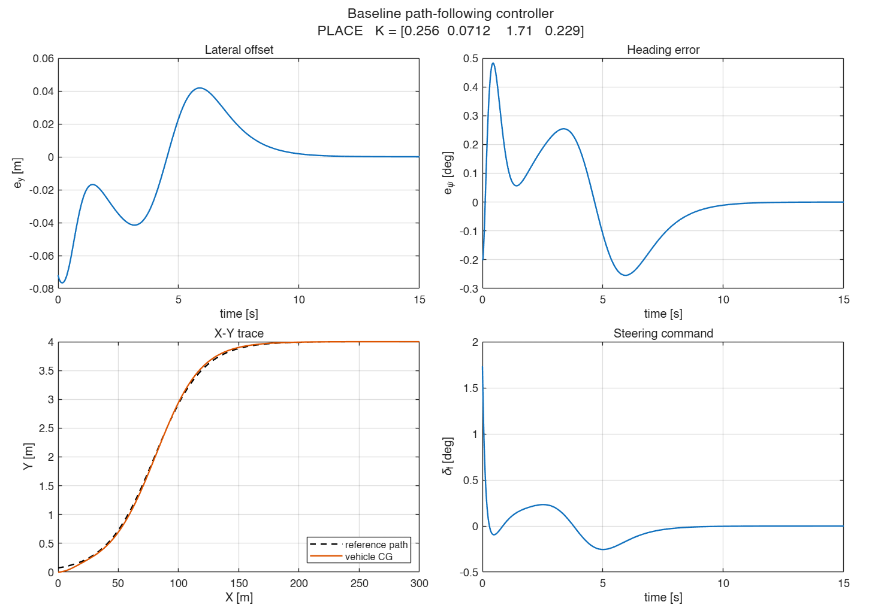

# Vehicle Path-Following Control Testbed

**English** | [한국어](README.ko.md)

A ready-to-run MATLAB/Simulink environment for lateral path-following
control. A car drives at 20 m/s along an S-shaped lane-change path, and a
steering controller keeps it on the path.

- **Plant** – nonlinear single-track vehicle (*Vehicle Body 3DOF Single Track* block)
- **Path and errors** – S-shaped lane change; lateral offset `e_y` and heading error `e_psi` computed on-line
- **Reference controller** – full-state feedback (pole placement, LQR), the complete baseline solution
- **Tools** – fast MATLAB copy of the loop, standard metrics and plots, live X-Y monitor, self-tests

Use it as the starting point for your own project.



## Requirements

| Product | Used for |
|---|---|
| MATLAB, Simulink | model, simulation |
| Control System Toolbox | `place`, `lqr`, `ss` |
| Vehicle Dynamics Blockset | vehicle plant block |

Tested with MATLAB R2026a. With an older release, delete
`path_following_baseline.slx` and run `build_simulink_model` to regenerate
the model.

## Quick start

Run from the project folder:

```matlab
run_baseline                             % reference design + Simulink run, figures -> results/
open_system('path_following_baseline')   % open the Simulink model and press Run
my_design_template                       % template for your own design -> results/my_design/
cd tests; run_tests                      % self-check of the environment (about 2 min)
```

When the model is run interactively, a live X-Y figure follows the vehicle.
Set `xy_monitor_on = 0` in the workspace to switch it off.

## How to use

**Signals.** Error state `e = [e_y; e_y_dot; e_psi; e_psi_dot]` (`e_y > 0`:
vehicle left of the path, angles in rad). Control input: front road-wheel
angle `delta_f` [rad], saturated at ±30°.

### 1. Try your own design

Copy `my_design_template.m` (e.g. to `my_design.m`) and edit the parts marked
`EDIT`: the scenario and the controller. The script runs the fast MATLAB
simulation, compares with the reference design, checks the result in
Simulink, and writes metrics and plots to `results/<tag>/`.

```matlab
ctrl = design_state_feedback(A, B, 'place', struct('poles', p));    % your poles
ctrl = design_state_feedback(A, B, 'lqr', struct('Q', Q, 'R', R));  % or LQR
```

### 2. Change the scenario

| `scenario` | Path | Used in |
|---|---|---|
| `'baseline'` | `Xoff = 80 m`, `eta = 40 m` | baseline project |
| `'sharp_lane_change'` | `Xoff = 50 m`, `eta = 20 m` | high-curvature path (e.g. feedforward) |

```matlab
[veh, pth, sim_opt] = load_params('sharp_lane_change');   % MATLAB
init_model_workspace([], [], 'sharp_lane_change');        % Simulink (before sim)
```

Vehicle parameters, speed and simulation time are in `src/load_params.m`.

### 3. Plug in your own controller

- **MATLAB simulation** – any static law `delta = law(e, aux)`:

  ```matlab
  ctrl.law = @(e, aux) ... ;     % aux = [Xp, Yp, psi_p, kappa, psi_dot_des]
  log = simulate_closed_loop(veh, pth, ctrl, sim_opt);
  ```

- **Simulink** – replace the contents of the *State Feedback Controller*
  subsystem and keep its ports: inputs `y_e, y_e_dot, psi_e, psi_e_dot`,
  output `WhlAngF` [rad]. Blocks with internal states (observer,
  identifier, filter) can also go between *Path Tracking Errors* and the
  controller. The path curvature is the 4th element of the `path_info`
  output of *Path Tracking Errors*.
  Save your model under a new name, because `build_simulink_model`
  overwrites `path_following_baseline.slx`.

### 4. Evaluate and compare

```matlab
log = simulink_log_to_struct(out);          % Simulink output -> same struct as the MATLAB simulation
M   = performance_metrics(log);             % max / rms of e_y, e_psi, delta
plot_results(log, pth, ctrl, 'results/mine', 'mine');                  % e_y, e_psi, X-Y, steering plots
plot_comparison({log_a, log_b}, {'A', 'B'}, 'results/mine', 'a_vs_b', 'A vs B');
```

### Key files

| File | Content |
|---|---|
| `src/load_params.m` | all parameters and scenarios |
| `src/error_model_linear.m` | linear error model `A, B, Bd, C` |
| `src/design_state_feedback.m` | pole placement / LQR |
| `src/path_tracking_errors.m` | `e_y`, `e_psi` and their rates |
| `src/simulate_closed_loop.m` | fast MATLAB copy of the Simulink loop |
| `path_following_baseline.slx` | Simulink model (built by `build_simulink_model.m`) |

## Example proposals

Some topic ideas for this testbed. Topics not listed here, or your own
project, are just as welcome.

- **Observer-based feedback** – lane sensors measure only `e_y` and `e_psi`; estimate the rest of the state.
- **Online identification** – identify the yaw dynamics (steering `delta_f` to yaw rate `r`) in real time.
- **Feedforward** – use the path curvature to improve tracking on the `'sharp_lane_change'` scenario.
- **MPC** – predictive control on the linear error model with steering angle / rate limits.
- **Reinforcement learning** – train a steering policy on the fast MATLAB simulation, or use RL / Bayesian optimization to tune `K`; then validate in Simulink.
- **Geometric controllers** – Pure Pursuit or Stanley vs. state feedback.
- **Speed variation** – `A`, `B` depend on `V_x`; gain scheduling over a speed range.
- **Robustness** – model mismatch (the `'raw'` block mode is a ready-made case), H∞ design.
- **Sensing and actuation** – sensor noise and a Kalman filter; steering delay and rate limits.
- **Other paths** – double lane change, circle, waypoints (edit `path_reference.m`, `path_closest_point.m`).

## More details

- [`docs/baseline_reference.md`](docs/baseline_reference.md) – model, controller design, results and notes of the baseline solution
- [`docs/plant_model.html`](docs/plant_model.html) – step-by-step derivation of the plant model and what `A`, `B`, `Bd`, `C`, `D` mean (Korean; open in a browser)

## License

[MIT](LICENSE)
