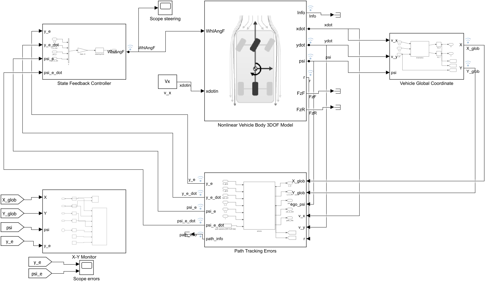

# Baseline Reference – Model, Design and Results

Technical reference for the provided baseline solution: the Simulink model,
the control-oriented model, the controller design and the results. For
installation and usage see the [README](../README.md).


## Contents

- [Repository layout](#repository-layout)
- [Simulink model](#simulink-model)
- [Control-oriented model](#control-oriented-model)
- [Controller design](#controller-design)
- [Results](#results-simulink-vehicle-body-3dof-single-track-plant)
- [Notes and challenges](#notes-and-challenges)
- [Verification](#verification-testsrun_testsm)

## Repository layout

| Path | Content |
|---|---|
| `run_baseline.m` | main script: model, design, sweep, Simulink validation, plots, metrics |
| `my_design_template.m` | starting point for your own design (scenario, controller, MATLAB + Simulink run, plots) |
| `build_simulink_model.m` | programmatic construction of the Simulink diagram |
| `path_following_baseline.slx` | generated Simulink model |
| `src/load_params.m` | all numeric parameters, scenario presets |
| `src/init_model_workspace.m` | creates the workspace variables the Simulink blocks need |
| `src/error_model_linear.m` | control-oriented error model `A, B, Bd, C` |
| `src/design_state_feedback.m`, `src/default_poles.m` | eigenvalue assignment / LQR gain |
| `src/path_reference.m`, `src/path_closest_point.m`, `src/path_tracking_errors.m` | "Path Tracking Errors" block code |
| `src/global_coordinate.m` | "Vehicle Global Coordinate" block code |
| `src/vdb_block_params.m` | parametrisation of the Vehicle Body 3DOF Single Track block (see Notes) |
| `src/vehicle_body_3dof.m`, `src/closed_loop_rhs.m`, `src/simulate_closed_loop.m` | pure-MATLAB single-track plant + RK4 loop, used for fast design sweeps and as a cross-check of the Simulink results |
| `src/simulink_log_to_struct.m` | converts the Simulink signal log to the same log struct as the MATLAB simulation |
| `src/xy_monitor_update.m` | animated X-Y monitor figure used by the "X-Y Monitor" subsystem |
| `src/plot_results.m`, `src/plot_comparison.m`, `src/performance_metrics.m`, `src/print_metrics_table.m` | standard plots and metrics |
| `tests/run_tests.m` | verification suite (11 checks) |
| `results/` | figures (`*.png`), `metrics.txt`, `design_sweep.txt`, `baseline_design.mat`, `baseline_run.mat` |
| `docs/` | this document, README figures |

## Simulink model



Block diagram:

```
State Feedback Controller ──WhlAngF──► Nonlinear Vehicle Body 3DOF Model ──ydot, psi, r──► Vehicle Global Coordinate
        ▲  y_e, y_e_dot, psi_e, psi_e_dot                     │                                    │ X, Y
        └──────────────────────────────── Path Tracking Errors ◄───────────────────────────────────┘
                                          (also receives v_x, v_y, r)
```

* **Nonlinear Vehicle Body 3DOF Model** – the library block with
  *Longitudinal velocity: external* (`xdotin` = constant `v_x` = 20 m/s),
  m = 1600 kg, a = lf = 1.4 m, b = lr = 1.6 m, Izz = 2000 kg m², linear
  tyres with per-axle stiffness Cf = Cr = 50 kN/rad (see Notes for how the
  block's `Cy_f`, `Cy_r`, `Fznom` are set), zero initial states.
* **Vehicle Global Coordinate** – MATLAB Function block
  `[Xdot; Ydot] = R(psi) [v_x; v_y]` followed by two integrators starting at
  (0, 0). It matches the position in the block's `Info` bus to machine
  precision.
* **Path Tracking Errors** – MATLAB Function block. It projects the CG onto
  the path `Y = WH tanh((X − Xoff)/η) + WH` (Newton iteration on the
  squared distance), then computes

  | signal | definition |
  |---|---|
  | `y_e` | signed lateral offset along the path normal, left of the path positive |
  | `psi_e` | `psi − psi_path`, wrapped to (−π, π] |
  | `y_e_dot` | `Vx sin(psi_e) + Vy cos(psi_e)` |
  | `psi_e_dot` | `r − κ ṡ`, with `ṡ = (Vx cos psi_e − Vy sin psi_e)/(1 − κ y_e)` |

  and outputs `path_info = [Xp, Yp, psi_p, kappa, psi_dot_des]` for plotting.
* **State Feedback Controller** – `WhlAngF = sat(−K [y_e; y_e_dot; psi_e; psi_e_dot])`
  with a ±30° road-wheel saturation (never active in the baseline).
* **X-Y Monitor** – live view of the vehicle position while the simulation
  runs (`results/simulink_xy_monitor.png` shows the inside):
  * an *XY Graph* block with the CG trace `X` vs `Y` (double-click it during
    or after a run; Simulink-native, no reference path in this view);
  * a *live path plot* MATLAB Function block that drives an animated MATLAB
    figure (`src/xy_monitor_update.m`): dashed reference path, growing CG
    trace, the ego vehicle drawn as a triangle centred on the CG with its
    nose pointing along the yaw angle `psi`, and a title with `t`, `X`, `Y`,
    `psi`, `e_y`. Because the axes are far from equal aspect (~300 m in `X`
    vs. a few metres in `Y`) the triangle has a fixed on-screen size and is
    rotated by the heading as it appears on screen, so its nose follows the
    plotted trace; the true heading is shown in the title.
    The signals are sampled every `Ts_mon` = 0.05 s (Zero-Order Hold blocks)
    and the figure is switched with the base-workspace flag `xy_monitor_on`
    (1 when the model is opened; `run_baseline` sets 0 for batch runs).
* **Layout and wiring.** Forward path left to right on the top row; the
  Path Tracking Errors block is flipped (inputs on its right side) so the
  four feedback signals run right to left along the bottom row into the
  controller. `v_x` for the coordinate and error blocks is taken from the
  vehicle block's `xdot` output. The monitoring blocks
  (X-Y Monitor, Scope errors) are fed through global Goto/From tags
  `X_glob`, `Y_glob`, `psi`, `y_e`, `psi_e` (Goto blocks sit inside the
  Vehicle Global Coordinate and Path Tracking Errors subsystems), so the top
  level shows only the control-loop wiring.
* **Workspace variables.** Opening the model runs its `PreLoadFcn`, which
  adds `src/` to the path and calls `init_model_workspace` to create the
  variables the blocks need (`veh`, `blk`, `pth_vec`, `Vx`, `K`,
  `delta_max`, `Ts_mon`, `xy_monitor_on`). The path is taken from the
  base-workspace variable `scenario` if it exists (default `'baseline'`).
* **Logging.** Solver `ode4`, fixed step 1 ms, 15 s. Signals are recorded
  with signal logging (the antenna badges on `WhlAngF`, `ydot`, `psi`, `r`,
  `X_glob`, `Y_glob`, `y_e`, `y_e_dot`, `psi_e`, `psi_e_dot`, `path_info`,
  `Info`) into `out.logsout`; `simulink_log_to_struct` converts that Dataset
  to the log struct used by the plots and metrics. A picture of the diagram
  is exported to `results/simulink_diagram.png` when the model is built.

## Control-oriented model

Single-track (bicycle) lateral/yaw dynamics with constant `Vx`, small angles
and per-axle cornering stiffnesses, written in path-error coordinates
(Rajamani, *Vehicle Dynamics and Control*, Ch. 2–3). With
`ey_dot = Vy + Vx epsi` and `epsi_dot = r − psi_dot_des`:

```
x = [ey; ey_dot; epsi; epsi_dot],  u = delta_f,  d = psi_dot_des = Vx*kappa

      | 0        1                    0                  0                     |
A  =  | 0  -(Cf+Cr)/(m Vx)        (Cf+Cr)/m       (-Cf lf + Cr lr)/(m Vx)     |
      | 0        0                    0                  1                     |
      | 0  -(Cf lf - Cr lr)/(Izz Vx) (Cf lf - Cr lr)/Izz  -(Cf lf² + Cr lr²)/(Izz Vx) |

B  = [0;  Cf/m;  0;  Cf lf/Izz]
Bd = [0;  (-Cf lf + Cr lr)/(m Vx) - Vx;  0;  -(Cf lf² + Cr lr²)/(Izz Vx)]
```

Numerically (`Vx` = 20 m/s):

```
A = [0  1       0     0      ;      B  = [0; 31.25; 0; 35]
     0 -3.125  62.5   0.3125 ;      Bd = [0; -19.6875; 0; -5.65]
     0  0       0     1      ;
     0  0.25   -5    -5.65   ]      eig(A) = {0, 0, -4.39 ± 1.82i},  rank ctrb = 4
```

The two zero eigenvalues are the position/heading integrations; the complex
pair is the vehicle's own yaw mode (understeering, ζ ≈ 0.92). The path
curvature enters through `Bd`; feedback alone cannot cancel it, which is why
a small lag remains during the lane change.

Full step-by-step derivation, the meaning of each entry of `A`, `B`, `Bd`,
and the output matrices `C`, `D` for the extended tasks:
[`plant_model.html`](plant_model.html) (Korean).

## Controller design

**Eigenvalue assignment (primary).** Closed-loop poles
`{−2.5 ± 2.5i, −6, −8}`: a dominant pair with ωn = 3.5 rad/s, ζ = 0.71
(lateral offset settles in about 1.5 s) and two faster real poles for the
heading/yaw states.

```
K = place(A, B, poles) = [0.256   0.0712   1.708   0.229]
```

**LQR (alternative, extra credit).** Bryson weights: 0.1 m lateral error and
1° heading error are each "as costly" as 2° of steering:
`Q = diag(100, 0, 3283, 0)`, `R = 821`, giving
`K = [0.349 0.0871 2.330 0.199]` and poles `{−6.5 ± 5.5i, −2.7 ± 2.0i}`.

**Design sweep** (`results/design_sweep.txt`, pure-MATLAB RK4 loop):

| design | max\|ey\| [m] | rms ey [m] | max\|eψ\| [°] | max\|δ\| [°] | ∫δ² dt |
|---|---|---|---|---|---|
| slow poles {−1.5 ± 1.5i, −4, −5} | 0.138 | 0.073 | 0.39 | 0.33 | 7.6e-5 |
| **default {−2.5 ± 2.5i, −6, −8}** | **0.077** | **0.026** | **0.48** | **1.73** | **1.0e-4** |
| fast poles {−4 ± 4i, −10, −12} | 0.073 | 0.012 | 0.95 | 9.15 | 6.8e-4 |
| LQR | 0.075 | 0.024 | 0.54 | 2.30 | 1.4e-4 |

The slow set lets the initial offset persist for several seconds, the fast
set spends 9° of steering on a 7 cm offset without improving the peak error;
the default set is the compromise.

## Results (Simulink, Vehicle Body 3DOF Single Track plant)

Full numbers in `results/metrics.txt`; figures `results/baseline_place_*.png`
(pole placement), `results/baseline_lqr_*.png`, `results/place_vs_lqr.png`.

| run | max\|ey\| [m] | rms ey [m] | max\|eψ\| [°] | rms eψ [°] | max\|δ\| [°] | rms δ [°] |
|---|---|---|---|---|---|---|
| pole placement | 0.077 | 0.026 | 0.48 | 0.15 | 1.73 | 0.15 |
| LQR | 0.075 | 0.024 | 0.54 | 0.15 | 2.30 | 0.17 |
| pole placement, "raw" block parametrisation | 0.075 | 0.019 | 0.41 | 0.10 | 1.73 | 0.12 |

Reading the plots:

* The vehicle starts at (0, 0) while the path starts at Y(0) = 0.072 m, so
  the run begins with `ey = −7.2 cm`, `epsi = −0.2°`. The controller removes
  this with a 1.7° steering peak; `|ey|` is below 1 cm after 1.5 s.
* During the lane change (curvature up to 9.6e-4 1/m, i.e. R ≈ 1040 m,
  `psi_dot_des` up to 0.019 rad/s) the feedback-only loop lags the path by
  up to 4.2 cm (pole placement) / 3.7 cm (LQR) with heading errors below
  0.26° and steering within ±0.25°. Both errors return to zero once the path
  is straight again; final values are 0.0000 m and 0.000°.
* Control effort is small (rms steering 0.15°). The LQR gain trades slightly
  more steering for a slightly smaller lateral error.
* Cross-check: the same controller on the pure-MATLAB single-track plant
  agrees with the Simulink run to 0.15 mm in `ey` and 0.0012° in `epsi`
  (`results/crosscheck_simulink_vs_matlab.png`).

Possible improvements: feedforward steering from the path curvature (removes
the lag), integral action or disturbance estimation for the curvature
disturbance, starting the vehicle on the path, an observer if only `ey`,
`epsi` are measured.

## Notes and challenges

1. **Cornering stiffness convention of the Simulink block.** The Vehicle
   Body 3DOF Single Track block computes the axle force as
   `Fy = Cy · α · Fz / Fznom`, i.e. `Cy_f`, `Cy_r` are stiffnesses at the
   nominal load `Fznom` (default 5000 N), not at the actual axle loads
   (8371 N front, 7325 N rear here). Typing 50 kN/rad straight into the
   block gives effective stiffnesses of 84 and 73 kN/rad, an almost
   neutral-steering car whose yaw-rate gain is 30 % above the design model
   (verified in `tests/run_tests.m`, check 5b). `vdb_block_params.m` therefore
   offers two parametrisations, selected by `veh.block_mode` in `load_params`:
   * `'match_design'` (default): aero coefficients zero (no load transfer)
     and `Cy_f = Cf·Fznom/Fz_f`, `Cy_r = Cr·Fznom/Fz_r`, so the effective
     per-axle stiffnesses are exactly Cf = Cr = 50 kN/rad. The block then
     matches the linear model to 0.3 % in a step-steer test (check 5a).
   * `'raw'`: the naive setting, used in `run_baseline` as a robustness check.
     The controller still converges with even smaller errors on this stiffer
     vehicle (`results/block_config_match_vs_raw.png`).
2. **Per-axle stiffness.** The single-track model has one tyre per axle, so
   Cf, Cr are per-axle values and no factor 2 appears in `A`, `B`.
3. **Tyre relaxation length.** The block keeps its default relaxation length
   of 0.1 m (a 5 ms first-order lag at 20 m/s). It is retained as "tyre
   dynamics"; its effect on the results is below 0.2 mm.
4. **Block library name.** The block lives in `vehdynlibeom`
   (`vehdynlibeom/Vehicle Body 3DOF Single Track`), not in a library called
   `vdynblks`; a copy exists in `autolibshared`.
5. **Logging layout.** *To Workspace* in `Array` format stores a 1×5 vector
   signal as a 1×5×N array; `simulink_log_to_struct` normalises it to N×5.

## Verification (`tests/run_tests.m`)

1. path derivatives vs. finite differences
2. error block sign convention (`ey` left-positive) and error rates
3. linear error model vs. numerical Jacobian of the nonlinear single-track equations
4. eigenvalue assignment accuracy
5. (a) block with `'match_design'` vs. linear model in a 1° step-steer test;
   (b) block with `'raw'` explained by `Cy·Fz/Fznom`
6. closed loop Simulink vs. pure-MATLAB RK4; X-Y Monitor figure driven by
   the run (saved as `results/xy_monitor_check.png`); `path_info` log layout
   and curvature; Vehicle Global Coordinate vs. the block's own position;
   convergence within the steering limit
